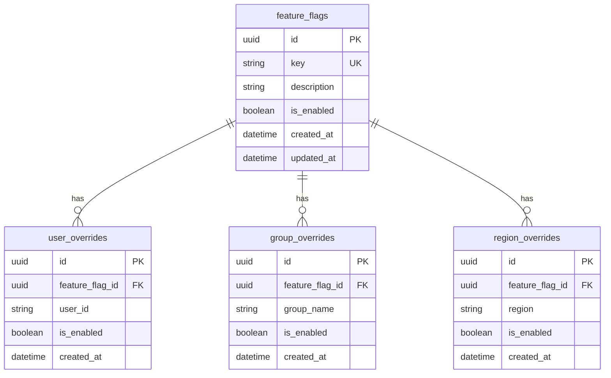

# Feature Flag Engine

A lightweight feature flag system built with NestJS, Prisma, and PostgreSQL. Supports global, user-specific, group-specific, and region-specific overrides with a clear evaluation precedence.

## Prerequisites

- Node.js >= 20
- PostgreSQL database (you provide the connection URL)

## Setup & Run

```bash
# 1. Copy environment file and add your database URL
cp .env.example .env
# Edit .env and set DATABASE_URL to your PostgreSQL connection string

# 2. Install dependencies
npm install

# 3. Run database migration
npx prisma migrate dev --name init

# 4. Start the server
npm run start:dev
```

The API runs at `http://localhost:3000`.

## API Documentation (Swagger)

**Interactive API docs:** [http://localhost:3000/api](http://localhost:3000/api)

Once the server is running, open the link above to explore all endpoints, request/response schemas, and try requests directly from the browser. No extra tooling required.

## Running Tests

```bash
# Unit tests (no database required)
npm test

# Unit tests with coverage
npm run test:cov

# E2E tests (requires DATABASE_URL in .env pointing to a PostgreSQL instance)
npm run test:e2e
```

## API Examples (curl)

Below are copy-paste curl examples. You can also use the [Swagger UI](#api-documentation-swagger) to try these interactively.

### Create a feature flag

```bash
curl -X POST http://localhost:3000/features \
  -H "Content-Type: application/json" \
  -d '{"key": "dark-mode", "isEnabled": false, "description": "Enable dark mode UI"}'
```

### Set a user override

```bash
curl -X PUT http://localhost:3000/features/dark-mode/overrides/users/user-123 \
  -H "Content-Type: application/json" \
  -d '{"isEnabled": true}'
```

### Evaluate a flag

```bash
curl -X POST http://localhost:3000/features/dark-mode/evaluate \
  -H "Content-Type: application/json" \
  -d '{"userId": "user-123", "groups": ["beta-testers"], "region": "eu"}'
```

### List all flags

```bash
curl http://localhost:3000/features
```

## Database Schema



DBML is auto-generated from the Prisma schema. Run `npx prisma generate` to produce `prisma/schema.dbml`, which you can import into [dbdiagram.io](https://dbdiagram.io) for editing or export.

## Architecture

```
src/
  core/               # Pure domain logic (no framework deps)
    evaluator.ts      # Flag evaluation with precedence rules
    types.ts          # Domain interfaces
  features/           # NestJS feature module
    features.controller.ts
    features.service.ts
    flag-cache.service.ts
    dto/              # Request validation
  prisma/             # Database module
```

The core evaluation logic lives in `src/core/` and has **zero dependencies** on NestJS, Prisma, or any framework. It's a pure function that takes a flag, its overrides, and an evaluation context, then returns a result. This makes it trivially testable and reusable.

### Evaluation Precedence

When evaluating a feature flag for a given context:

1. **User override** (highest priority) — if the user has a specific override, use it
2. **Group override** — if the user belongs to a group with an override, use it (first match wins)
3. **Region override** — if the request comes from a region with an override, use it
4. **Global default** — fall back to the flag's default state

### Caching

The evaluation path uses an in-memory cache (30s TTL) to avoid hitting the database on every request. The cache is automatically invalidated whenever a flag or any of its overrides are modified. For a single-instance deployment this is sufficient; for multi-instance you'd swap to Redis.

## Assumptions

- **No auth**: The API is unauthenticated. In production you'd add guards/middleware.
- **Group membership is caller-provided**: The system doesn't maintain a user-to-group mapping. The caller passes their groups in the evaluation context. This keeps the flag engine focused on evaluation rather than identity management.
- **Single key format**: Feature flag keys must be lowercase alphanumeric with hyphens (e.g., `dark-mode`, `new-checkout-flow`). This prevents accidental duplicates from casing differences.
- **First matching group wins**: When a user belongs to multiple groups, the first group in the array that has an override determines the result. The caller controls priority by ordering the groups array.

## Tradeoffs

| Decision | Why |
|----------|-----|
| Prisma over raw SQL | Type-safe queries, auto-generated client, schema-as-code. Tradeoff: slightly less control over complex queries. |
| In-memory cache over Redis | Simpler setup, no extra infra. Fine for single-instance. Would need Redis for horizontal scaling. |
| Upsert for overrides | `PUT` is idempotent — setting an override twice with the same value is safe. Simpler than separate create/update flows. |
| Evaluation returns `reason` | Helps with debugging. A consumer can see *why* a flag was enabled, not just that it was. |


## Known Limitations

- In-memory cache means stale reads are possible within the TTL window (30s)
- No pagination on the list endpoint — fine for hundreds of flags, not thousands
- No database seeding script included
